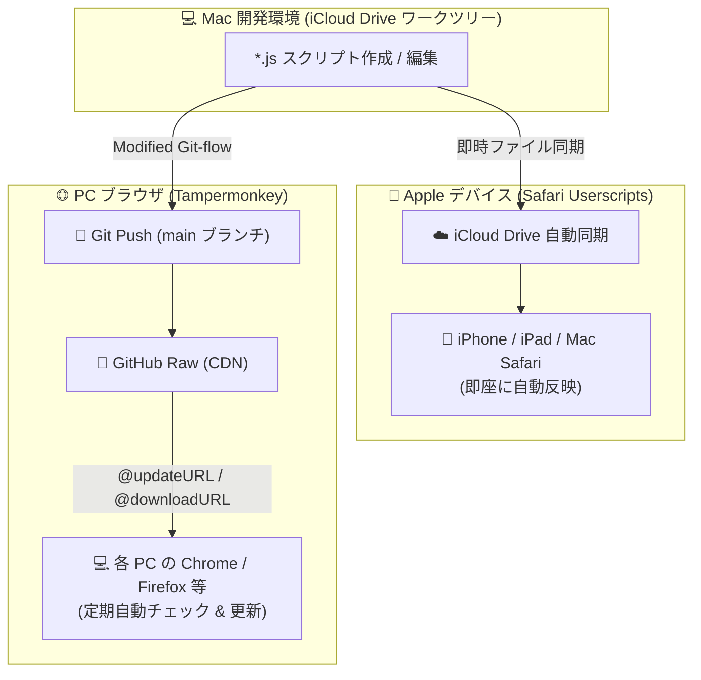

# 🌐 Userscripts & Custom Styles Repository

[](https://apps.apple.com/app/userscripts/id1463298887)
[](https://chromewebstore.google.com/detail/tampermonkey/dhdgffkkebhmkfjojejmpbldmpobfkfo)
[](https://addons.mozilla.org/firefox/addon/tampermonkey/)
[](./LICENSE)
[](#)

iOS / iPadOS / macOS の Safari 拡張機能 **「Userscripts」** および 全ブラウザの **「Tampermonkey」** で完全互換動作するユーザースクリプト（機能拡張・スタイル調整）の統合管理リポジトリです。

---

## 🌟 自動同期・配信アーキテクチャ

本リポジトリは、**「iOS 端末への iCloud リアルタイム同期」** と **「全 PC のブラウザ（Chrome / Firefox 等の Tampermonkey）への GitHub 自動配信」** を両立するシームレスな同期基盤を備えています。



### 3つのコアメリット
1. **📱 iOS 端末へのリアルタイム自動同期**:
   - ワークツリーが iCloud Drive 上にあるため、Mac でファイルを保存した瞬間に iPhone / iPad の Safari に反映されます。
2. **🔄 全 PC の Tampermonkey への自動配信**:
   - 各スクリプトに `@updateURL` が組み込まれており、GitHub の `main` ブランチへ push すると、各端末の Tampermonkey が自動で最新版を取得・更新します。
3. **🎨 スタイルとスクリプトの完全一本化 (Stylus 不要)**:
   - スタイルシートもすべて `GM_addStyle` 注入形式の `.js` スクリプトとして統一管理されているため、Stylus 等の別拡張機能は不要です。

---

## 📁 スクリプトカタログ

全スクリプトに Tampermonkey 自動更新用メタデータ（`@updateURL` / `@downloadURL`）が付与されています。  
Chrome や Firefox などの Tampermonkey を導入したブラウザで表内の **「インストール (Raw Link)」** を開くと、Tampermonkey のインストール画面が自動起動します。

### 📜 機能拡張・自動化スクリプト (`.js`)

| ファイル名 | 名称 (@name) | 対象サイト (@match) | インストール | 概要 |
| :--- | :--- | :--- | :---: | :--- |
| `x_swipe.js` | X (Twitter) Swipe Tab Switcher | `x.com`, `twitter.com` | [Raw Link](https://raw.githubusercontent.com/kohosei/Userscripts/main/x_swipe.js) | タイムラインタブ（おすすめ / フォロー中 / リスト）を左右スワイプで切り替え |
| `x_reply_hide.js` | Hide_X_Replies | `x.com`, `twitter.com` | [Raw Link](https://raw.githubusercontent.com/kohosei/Userscripts/main/x_reply_hide.js) | ツイート詳細ページでリプライ欄を非表示（ポスト主自身のリプライは残す） |
| `instagram_comments_hide.js` | InstagramLiveCommentHider | `instagram.com` | [Raw Link](https://raw.githubusercontent.com/kohosei/Userscripts/main/instagram_comments_hide.js) | Instagram Live 視聴時のコメント欄および関連 UI を非表示 |
| `onsen_order.js` | 音泉 お気に入り番組 並び替えトグル | `onsen.ag` | [Raw Link](https://raw.githubusercontent.com/kohosei/Userscripts/main/onsen_order.js) | お気に入り番組の表示順（デフォルト / 更新順 / 逆順）をワンタップ切替 |
| `ab_auto_login.js` | plusmember apollobay auto login | `secure.plusmember.jp` | [Raw Link](https://raw.githubusercontent.com/kohosei/Userscripts/main/ab_auto_login.js) | Apollo Bay ログイン画面での自動ログイン実行 |
| `ab_open_login_page.js` | apollobaycruiser auto open login | `apollobaycruiser.jp` | [Raw Link](https://raw.githubusercontent.com/kohosei/Userscripts/main/ab_open_login_page.js) | 未ログイン状態を検知して自動でログインページへ遷移 |
| `ab_disable_carousel.js` | Disable Carousel Autoplay | `apollobaycruiser.jp` | [Raw Link](https://raw.githubusercontent.com/kohosei/Userscripts/main/ab_disable_carousel.js) | トップページのカルーセル自動スクロールを停止（ログイン後遷移・BFCache対応） |
| `nagi_auto_login.js` | aoyamanagisa mypage auto login | `aoyamanagisa.jp` | [Raw Link](https://raw.githubusercontent.com/kohosei/Userscripts/main/nagi_auto_login.js) | マイページへのリダイレクトおよび自動ログイン |
| `nagi_mypage_redirect.js` | aoyamanagisa mypage redirect | `aoyamanagisa.jp` | [Raw Link](https://raw.githubusercontent.com/kohosei/Userscripts/main/nagi_mypage_redirect.js) | ログインページ以外の特定画面からマイページへ自動転送 |

---

### 🎨 カスタムスタイルスクリプト (`.js` - GM_addStyle 形式)

Stylus は不要です。Tampermonkey と Safari Userscripts の両方で同一コードで動作します。

| ファイル名 | 名称 (@name) | 対象サイト (@match) | インストール | 概要 |
| :--- | :--- | :--- | :---: | :--- |
| `yt_comments_hide.js` | Hide comments and live chat on YouTube | `youtube.com` | [Raw Link](https://raw.githubusercontent.com/kohosei/Userscripts/main/yt_comments_hide.js) | YouTube 動画ページのコメント欄およびライブチャット欄を非表示 |
| `qlover_comments_hide.js` | QloveR コメント非表示 | `qlover.jp` | [Raw Link](https://raw.githubusercontent.com/kohosei/Userscripts/main/qlover_comments_hide.js) | 配信画面のチャット・コメント欄を非表示 |
| `qlover_store_hide.js` | QloveR SmartBanner非表示 | `qlover.jp` | [Raw Link](https://raw.githubusercontent.com/kohosei/Userscripts/main/qlover_store_hide.js) | アプリインストール誘導バナー（SmartBanner）を非表示 |
| `onsen_footer_hide.js` | Hide footer-bottom-wrapper on www.onsen.ag | `onsen.ag` | [Raw Link](https://raw.githubusercontent.com/kohosei/Userscripts/main/onsen_footer_hide.js) | 画面下部の不要なフッター領域を非表示 |
| `joqr_cpr_hide.js` | JOQR Hide Copyright | `joqr.co.jp/ag` | [Raw Link](https://raw.githubusercontent.com/kohosei/Userscripts/main/joqr_cpr_hide.js) | 著作権表示フッターを非表示 |
| `hibiki_news_hide.js` | Hide news-list on hibiki-radio.jp | `hibiki-radio.jp` | [Raw Link](https://raw.githubusercontent.com/kohosei/Userscripts/main/hibiki_news_hide.js) | ニュース一覧セクションを非表示 |
| `ab_comments_hide.js` | HideBlogComments | `apollobaycruiser.jp` | [Raw Link](https://raw.githubusercontent.com/kohosei/Userscripts/main/ab_comments_hide.js) | 会員限定ブログのコメント欄を非表示 |
| `ab_notice_hide.js` | Hide sub-txt-list on apollobaycruiser.jp | `apollobaycruiser.jp` | [Raw Link](https://raw.githubusercontent.com/kohosei/Userscripts/main/ab_notice_hide.js) | サブテキスト一覧（お知らせ等）を非表示 |
| `nagi_footer_hide.js` | Hide footer-bottom on aoyamanagisa.jp | `aoyamanagisa.jp` | [Raw Link](https://raw.githubusercontent.com/kohosei/Userscripts/main/nagi_footer_hide.js) | サイト下部フッターを非表示 |
| `nagi_hide_title.js` | Hide timeline title card on aoyamanagisa.jp | `aoyamanagisa.jp` | [Raw Link](https://raw.githubusercontent.com/kohosei/Userscripts/main/nagi_hide_title.js) | タイムライン画面の巨大なタイトルカードを非表示 |
| `liella_banner_hide.js` | Hide bnrlink on yuigaoka top only | `lovelive-anime.jp/yuigaoka` | [Raw Link](https://raw.githubusercontent.com/kohosei/Userscripts/main/liella_banner_hide.js) | ページ上部・下部の各種バナーリンクを非表示 |
| `liellaclub_caption_footer_hide.js` | Hide selected elements on lovelive-liellaclub.jp | `lovelive-liellaclub.jp` | [Raw Link](https://raw.githubusercontent.com/kohosei/Userscripts/main/liellaclub_caption_footer_hide.js) | キャプションおよびフッターリンクを非表示 |
| `lovelive_link_hide.js` | Hide link on lovelive | `lovelive-anime.jp` | [Raw Link](https://raw.githubusercontent.com/kohosei/Userscripts/main/lovelive_link_hide.js) | SNS リンク等の導線を非表示 |

---

## 🚀 初期セットアップガイド

### 1. iOS / iPadOS での利用 (Safari Userscripts)
1. App Store から [Userscripts](https://apps.apple.com/app/userscripts/id1463298887) をインストール。
2. iOS の「設定」>「Safari」>「拡張機能」>「Userscripts」を有効化し、アクセス権を「すべての Web サイトで常に許可」に設定。
3. Userscripts アプリを開き、スクリプト保存先ディレクトリとして **iCloud Drive 内の `Userscripts` フォルダ** を選択。
4. これで完了です。Mac で編集するたびに、iOS 端末へ即時同期されます。
   *(※iOS 18 / macOS 15 以降では、ファイルがローカルから退避されないよう「ダウンロードしたままにする」設定を推奨)*

### 2. PC ブラウザ（Chrome / Firefox 等）での利用 (Tampermonkey)
1. 各ブラウザの拡張機能ストアから **[Tampermonkey](https://www.tampermonkey.net/)** をインストール。
   - **Chrome**: [Chrome ウェブストア](https://chromewebstore.google.com/detail/tampermonkey/dhdgffkkebhmkfjojejmpbldmpobfkfo)
   - **Firefox**: [Firefox Add-ons (AMO)](https://addons.mozilla.org/firefox/addon/tampermonkey/)
   - *(Safari / Edge 等でも同様に Tampermonkey 拡張機能を利用可能です)*
2. **初回の一括インストール**:
   - 上記カタログから個別にクリックしてインストールするか、
   - Tampermonkey ダッシュボードの「ユーティリティ」>「ファイルからインポート」から、リポジトリ内（またはダウンロードした）スクリプト群を一括インポートします。
3. **自動更新の動作**:
   - スクリプト内に `@updateURL` が含まれているため、`main` ブランチに更新が入ると Tampermonkey が自動で検知して更新します。
   - 即座に更新を確認したいときは、Tampermonkey アイコン > **「スクリプトの更新を確認」** をクリックします。

---

## 🛠️ スクリプトの追加・更新マニュアル（開発者・人間向け実務手順）

スクリプトの変更や新規追加を行う際は、以下のステップに沿って操作してください。

### パターン 1: 既存スクリプトを修正・改善するとき

1. **ブランチ作成**:
   ```bash
   git checkout develop && git pull origin develop
   git checkout -b fix/<対象スクリプト名>-<修正内容>
   ```
2. **コード修正 & バージョン引き上げ (必須)**:
   - スクリプト内の不具合修正やセレクタ更新を行います。
   - > [!IMPORTANT]
     > **必ずヘッダーの `@version` をインクリメントしてください**（例: `1.0` → `1.1`、`1.2.1` → `1.2.2`）。  
     > Tampermonkey は `@version` の数値が上がったことを検知して自動更新を実行します。数値を上げ忘れると Chrome / Firefox 等のブラウザ側に自動反映されません。
3. **品質検査**:
   ```bash
   node --check *.js
   ```
4. **コミット & develop 統合**:
   ```bash
   git add .
   git commit -m "fix(<スコープ>): <変更内容の要約>"
   git checkout develop
   git merge --no-ff fix/<対象スクリプト名>-<修正内容> -m "Merge branch 'fix/...' into develop"
   git branch -d fix/<対象スクリプト名>-<修正内容>
   ```
5. **本番リリース (main マージ & push)**:
   ```bash
   git checkout main
   git merge --no-ff develop -m "release: update <対象スクリプト名> to v<新バージョン>"
   git checkout develop
   git push origin develop main
   ```
   > [!TIP]
   > `main` に push された時点で、全端末の Chrome / Firefox 等の Tampermonkey へ自動配信がスタンバイされます。

---

### パターン 2: 新規スクリプトを追加するとき

1. **ブランチ作成**:
   ```bash
   git checkout develop && git pull origin develop
   git checkout -b feature/add-<スクリプト名>
   ```
2. **スクリプトファイルの作成**:
   - 拡張子は必ず **`.js`** とし、半角英小文字・アンダースコア（kebab/snake）で命名します。
   - **機能拡張の場合**:
     ```javascript
     // ==UserScript==
     // @name         スクリプト表示名
     // @namespace    http://tampermonkey.net/
     // @version      1.0
     // @description  スクリプトの概要説明
     // @match        https://example.com/*
     // @updateURL    https://raw.githubusercontent.com/kohosei/Userscripts/main/ファイル名.js
     // @downloadURL  https://raw.githubusercontent.com/kohosei/Userscripts/main/ファイル名.js
     // @grant        none
     // @run-at       document-idle
     // ==/UserScript==

     (function () {
       'use strict';
       // ここに処理を記述
     })();
     ```
   - **カスタムスタイルの場合 (Stylus 代替)**:
     ```javascript
     // ==UserScript==
     // @name         スタイル表示名
     // @namespace    http://tampermonkey.net/
     // @version      1.0
     // @description  スタイルの概要説明
     // @match        https://example.com/*
     // @updateURL    https://raw.githubusercontent.com/kohosei/Userscripts/main/ファイル名.js
     // @downloadURL  https://raw.githubusercontent.com/kohosei/Userscripts/main/ファイル名.js
     // @grant        GM_addStyle
     // @run-at       document-start
     // ==/UserScript==

     (function () {
       'use strict';

       const css = `
         .unwanted-element {
           display: none !important;
         }
       `;

       if (typeof GM_addStyle !== 'undefined') {
         GM_addStyle(css);
       } else {
         const style = document.createElement('style');
         style.textContent = css;
         (document.head || document.documentElement).appendChild(style);
       }
     })();
     ```
3. **README.md カタログへの追記**:
   - 本 README の「スクリプトカタログ」テーブルに、ファイル名・名称・対象サイト・Raw Link・概要を追記します。
4. **品質検査**:
   ```bash
   node --check *.js
   test -z "$(grep -L "@updateURL" *.js)" && echo "OK"
   ```
5. **コミット & develop 統合 & main リリース**:
   - パターン 1 と同様に `develop` にマージ後、`main` にマージして push します。
6. **Tampermonkey (Chrome / Firefox 等) への初回登録**:
   - 新規スクリプトの場合のみ、ブラウザ（Chrome / Firefox 等）側で README 内の [Raw Link] を 1 回クリックしてインストールします。

---

## ❓ トラブルシューティング

| 症状 | 原因 | 対処法 |
| :--- | :--- | :--- |
| **iOS Safari で変更が反映されない** | iCloud 同期の待機中、またはファイルがローカルから退避されている | 「ファイル」アプリで Userscripts フォルダを開き、雲マーク（未ダウンロード）になっていないか確認し「ダウンロードを保持」を設定してください。 |
| **Tampermonkey (Chrome / Firefox 等) で更新が降ってこない** | 1. `@version` が更新されていない<br>2. `main` ブランチに push されていない<br>3. Tampermonkey の定期チェック待機中 | 1. スクリプト内の `@version` を繰り上げてください。<br>2. `main` ブランチへ push されているか確認してください。<br>3. Tampermonkey アイコン > **「スクリプトの更新を確認」** を手動実行してください。 |
| **CSS スタイルが反映されない / チラつく** | `@run-at` が指定されていない | メタデータに `// @run-at document-start` を指定してください。DOM 生成直後の最速タイミングで注入されます。 |

---

## 🤖 AI エージェント開発ガイド

AI エージェント（Antigravity, Claude, ChatGPT 等）が本リポジトリで作業する場合は、マスタープロンプトおよび厳格な開発規範が定義された **[`AGENTS.md`](./AGENTS.md)** を必ず読み込み、その指示に従ってください。
